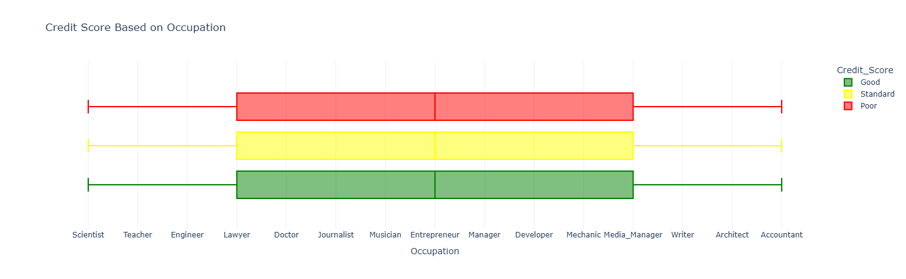
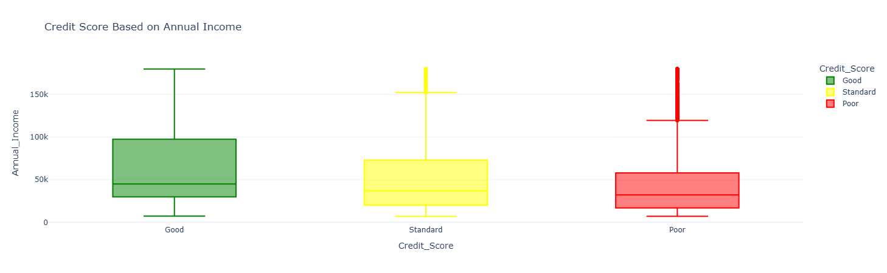
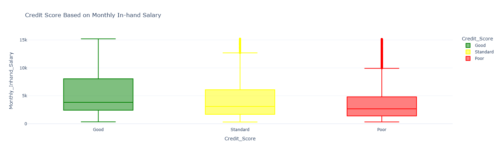
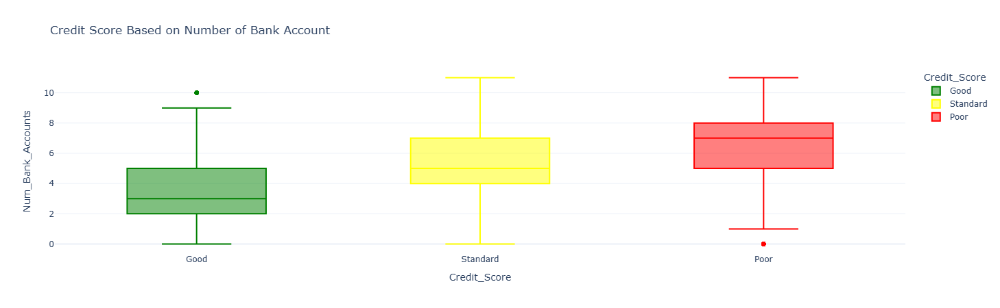
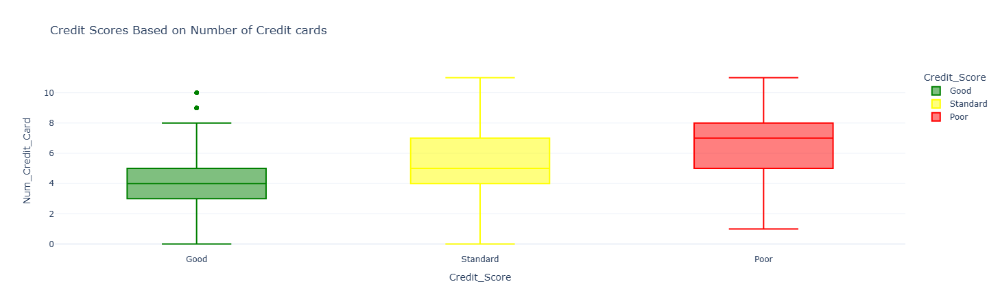
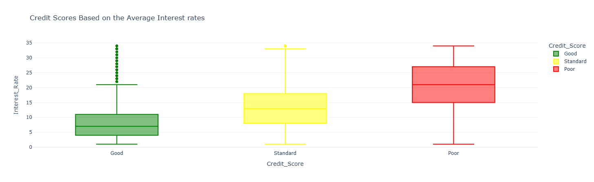
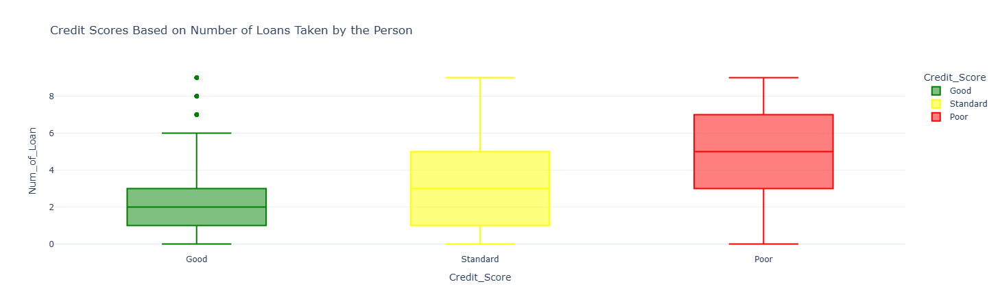
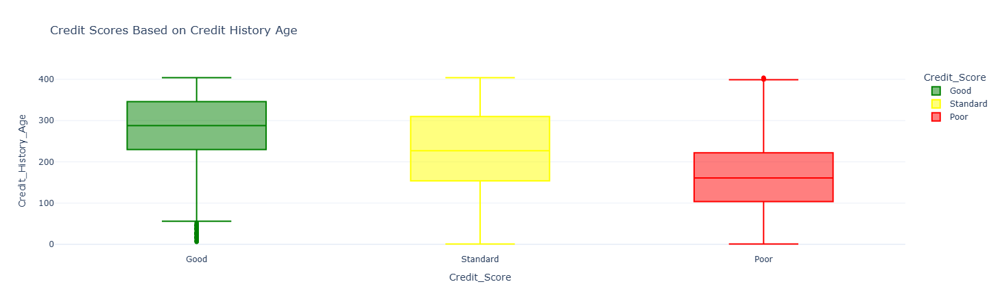

# Credit Score Classification

This project is a machine learning application designed to classify individuals into credit score categories — Good, Standard, or Poor — based on various financial and demographic inputs.

##  Project Objective

The goal is to develop a classification model that predicts a person's credit score category based on their financial behavior and personal background. This model can be useful in banking, financial assessments, and risk analysis.

---

##  Features Used

Key features from the dataset include:

- Occupation
- Annual Income
- Monthly In-hand Salary
- Number of Bank Accounts
- Number of Credit Cards
- Interest Rate
- Number of Loans

---

##  Data Visualizations

Several data visualizations help us understand how different features influence the credit score:

-  **Credit Score Based on Occupation**  
  

-  **Credit Score Based on Annual Income**  
  

-  **Credit Score Based on Monthly In-hand Salary**  
  

-  **Credit Score Based on Number of Bank Accounts**  
  ]

-  **Credit Score Based on Number of Credit Cards**  
  

-  **Credit Score Based on Interest Rate**  
   ]

-  **Credit Score Based on Number of Loans**  
  

- **Credit Score Based on Credit History Age**
  
  
The other graphics I used are not here because they do not affect the credit score, but if you want to see them, you can access them from the images folder.

> Classes are color-coded in all visuals:  
> - **Poor** = 🔴  
> - **Standard** = 🟡  
> - **Good** = 🟢

---

##  Technologies Used

- Python
- Pandas, NumPy
- scikit-learn (RandomForestClassifier)
- Plotly

---

##  Modeling Process

1. Data cleaning and preprocessing
2. Exploratory data analysis and visualization
3. Data split into training and testing sets
4. Model training using RandomForestClassifier
5. Evaluation of model accuracy and results

---

##  Conclusion and Future Work

- Visualizations show that income, occupation, and loan information strongly influence credit scores.
- The model performs well for basic classification but could be improved with more features or data.
- Interpretability tools like SHAP could be added to explain individual predictions.

---

##  How to Run This Project

```bash
pip install pandas numpy scikit-learn plotly
python credit_score_classification.ipynb
```

> Note: Be sure to adjust the CSV file path to match your local directory.

---

